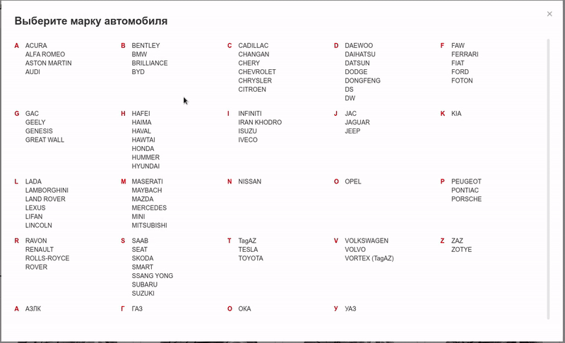

## Тестовое задание React / Redux

Предлагаю Вам выполнить тестовое задание на React с использованием Redux.

Требуется реализовать функционал выбора модификации автомобиля.

Необходимо отобразить всех производителей (марок) авто. Данные можно получить в запросе №1.

При клике на определенную марку появляется второго список — с выбором модели. Данные можно получить в запросе №2.

При клике на модель автомобиля — должен отобразиться экран с выбором поколения. Данные можно получить в запросе №3.

И так далее, до модификации.

После того как пользователь дошел до последнего шага и нажал на определенную модификацию — показать `alert` с названием модификации (ModificationItem.value).

Предусмотреть возможность возврата на предыдущий этап.

Все элементы в списках должны быть сгруппированы по алфавиту, слева от группы элементов — буква.
Тестовое задание следует выполнять в [codesandbox.io](http://codesandbox.io). Можно сделать форк от [готового React скелетона](https://codesandbox.io/s/exciting-carson-dvmv1).

Референс:

[Необходимые методы API](api.md)

**При оценке выполненного тестового задания не учитывается верстка.**
**Код необходимо написать с применением Redux, разработав собственный набор reducer'ов и необходимый набор состояний (states)**
